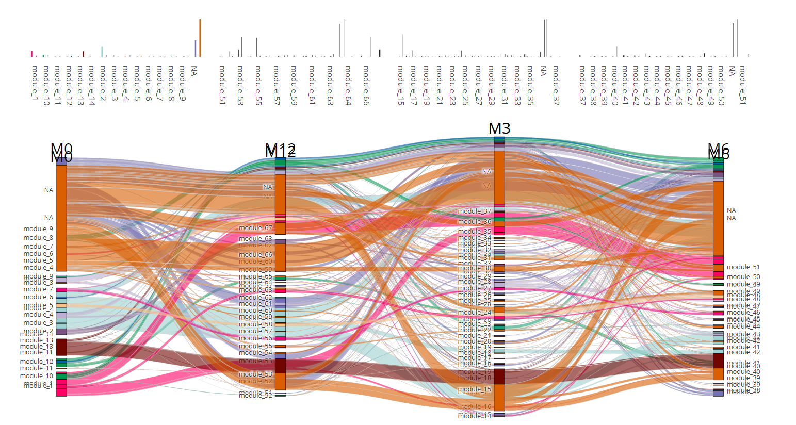

It is for pull issue for parcats. 
When you test it, you will find the problem that alluvial diagram will overlap in the same place.



# Run
```
# Install packages
requiredPackages <- c("shiny", "tidyverse", "dplyr", "easyalluvial", "parcats")			  
newPackages <- requiredPackages[!(requiredPackages %in% installed.packages()[,"Package"])]
if(length(newPackages)) BiocManager::install(newPackages, ask = TRUE)

# run this shiny APP
shiny::runApp()
```
